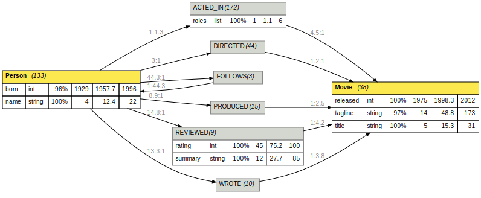

# Neo4jBolt

A Neo4j/Bolt driver written in pure Ruby. **Currently only supporting Neo4j 4.4 with Bolt 4.4.** Contains a CLI tool which can dump databases, load database dumps, and visualize database contents.

Caution: This gem is not feature complete regarding Neo4j and Bolt. Nevertheless, it is used successfully in production – make sure it supports the features you need.

- PackStream:
  - data types:
    - supported: Null, Boolean, Integer, Float, String, List, Dictionary, Structure
    - not supported: Bytes
  - structures:
    - supported: Node, Relationship
    - not supported: UnboundRelationship, Path, Date, Time, LocalTime, DateTime, DateTimeZoneId, LocalDateTime, Duration, Point2D, Point3D
- Bolt Protocol:
  - supported: transactions
  - not supported:
    - auto transactions (all transactions are explicit in Neo4jBolt)
    - routing
    - interrupt

## Installation

Add this line to your application's Gemfile:

```ruby
gem 'neo4j_bolt'
```

And then execute:

    $ bundle install

Or install it yourself as:

    $ gem install neo4j_bolt

In order to use this gem, you need a running Neo4j database. Chances are you already have a Neo4j database running if you're reading this. Otherwise, you can start one via Docker using the following command:

```
docker run --rm --env NEO4J_AUTH=none --publish 7687:7687 neo4j:4.4-community
```

If you want the Browser interface at http://localhost:7474/, additionaly specify `--publish 7474:7474`.

## Connecting to a Neo4j database

Specify your Bolt host and port (if you omit this it will be localhost:7687 by default):

```ruby
Neo4jBolt.bolt_host = 'localhost'
Neo4jBolt.bolt_port = 7687
```

Use `Neo4jBolt::cleanup_neo4j` to disconnect (this is important when running a web app – it might be a good idea to close a socket once we're done with it so we don't run out of available ports).

## Running queries

Use `neo4j_query` to run a query and receive all results:

```ruby
entries = neo4j_query("MATCH (n) RETURN n;")
```
Alternatively, specify a block to make use of Neo4j's streaming capabilities and receive entries one by one:

```ruby
neo4j_query("MATCH (n) RETURN n;") do |entry|
    # handle entry here
end
```

Using streaming avoids memory hog since it prevents having to read all entries into memory before handling them. Nodes are returned as `Neo4jBolt::Node`, relationships as `Neo4jBolt::Relationship`. Both are subclasses of `Hash`, providing access to all properties plus a few extra details:

- `Neo4jBolt::Node` attributes: `id`, `labels`
- `Neo4jBolt::Relationship` attributes: `id`, `start_node_id`, `end_node_id`, `type`

```ruby
node = neo4j_query_expect_one("CREATE (n:Node {a: 1, b: 2}) RETURN n;")['n']
# All nodes returned from Neo4j are a Neo4jBolt::Node
# It's a subclass of Hash and it stores all the node's
# properties plus two attributes called id and labels:
puts node.id
puts node.labels
puts node.keys
node.each_pair { |k, v| puts "#{k}: #{v}" }
puts node.to_json
puts "a: #{node[:a]}"
```

While values returned by Neo4j can be accesses via string keys (`['n']` in the example above), property keys of nodes and relationships are converted to symbols (`node[:a]`).

Use `neo4j_query_expect_one` if you want to make sure there's exactly one entry to be returned:

```ruby
node = neo4j_query_expect_one("MATCH (n) RETURN n LIMIT 1;")['n']
```

If there's zero, two, or more results, this will raise a `ExpectedOneResultError`.

## Setting up constraints and indexes

Use `setup_constraints_and_indexes` like this:

```ruby
CONSTRAINTS_LIST = ['User/email', 'Session/sid']
INDEX_LIST = ['Session/expires']
setup_constraints_and_indexes(CONSTRAINTS_LIST, INDEX_LIST)
```

This setup up two uniqueness constraints and one index:
- the `email` property of all nodes with label `User` must be unique
- the `sid` property of all nodes with label `Session` must be unique
- the `expires` property of all nodes with label `Session` gets indexed for faster lookup

Neo4jBolt prefixes all constraints and indexes declared this way with `neo4j_bolt_` and it will remove all such entries previously declared (as detected by the prefix) and not passed to `setup_constraints_and_indexes`. That way, constraints and indexes can be added and removed.

Neo4jBolt does not currently support putting constraints on relationships or declaring indexes on relationships or combining several properties into one uniqueness constraint. You are, however, free to declare these constraints and indexes via Cypher yourself.

## Housekeeping and inspection

Use the `neo4j_bolt` command line tool to perform various tasks regarding your database:

| Command | Description |
| ------- | ----------- |
| `neo4j_bolt console` | launch Pry console with Neo4jBolt |
| `neo4j_bolt clear` | remove all nodes and relationships, needs `--srsly` argument |
| `neo4j_bolt dump` | dump database contents |
| `neo4j_bolt load` | load database dump |
| `neo4j_bolt index ls` | list all database constraints and indexes |
| `neo4j_bolt index rm` | remove all constraints and indexes, needs `-f` |
| `neo4j_bolt visualize` | generates a visual representation of the current datbase contents |

Specify you Neo4j host and port using `--host` if your database is not running on localhost:7687.

### Dump database contents

When you dump a database, output will go to `/dev/stdout` by default, but it can be redirected to any file via `--out-file`. In the export, node IDs start at 0, regardless of the actual node IDs in the database, and start node / end node IDs in the relationship dumps are adjusted accodingly. Don't rely on actual node IDs within your database, as they may change during export and import. Relationship IDs are omitted in the export.

### Load database dump

A database dump can only be loaded if the database is empty. Otherwise, you'll have to specify `--force`.

### List constraints and indexes

Use the command `neo4j_bolt index ls` to see which constraints and indexes are currently active in the database.

### Remove all constraints and indexes

Use the command `neo4j_bolt index rm -f` to remove all constraints and indexes in the database but make sure you know what you're doing.

### Visualize database contents

Use the command `neo4j_bolt visualize` to obtain a GraphViz-formatted document suitable for piping into `dot`:

```bash
./bin/neo4j_bolt visualize | dot -Tsvg > graph.svg
```

If you don't have GraphViz installed, you can use a Docker image instead:

```bash
./bin/neo4j_bolt visualize | docker run --rm -i nshine/dot dot -Tsvg > graph.svg
```

The result looks like this for the movie graph example provided by Neo4j:



You can see nodes and relationships with their current numbers, plus all properties with their respective data types and for each data type the percentage of entities with that data type and min / mean / max values (for ints and floats) or min / mean / max lengths (for strings and lists).

Uniqueness constraints and indexes (if available) are shown as well if they are defined on a single node or relationship with a single attribute.

If a property is an integer and starts with `ts`, it gets treated as a UNIX timestamp (just for the visualization).

## Development

After checking out the repo, run `bin/setup` to install dependencies. Then, run `rake spec` to run the tests. You can also run `bin/console` for an interactive prompt that will allow you to experiment.

To install this gem onto your local machine, run `bundle exec rake install`. To release a new version, update the version number in `version.rb`, and then run `bundle exec rake release`, which will create a git tag for the version, push git commits and tags, and push the `.gem` file to [rubygems.org](https://rubygems.org).

## Contributing

Bug reports and pull requests are welcome on GitHub at https://github.com/specht/neo4j_bolt.

